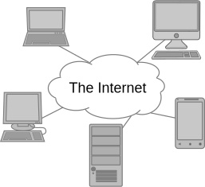
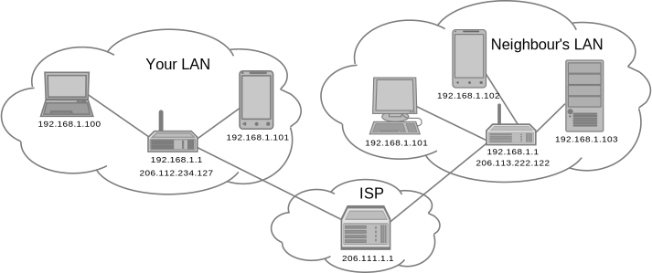

To put cloud computing into perspective, lets first take a look at how you use your computer and how it interacts with the Internet. The ideas and understanding gained here will be applicable not only to understanding how the cloud works, but also when you want to create web services using your cloud account for others to access and use.

These days everyone uses a computer connected to the Internet. Being connected to the Internet allows your computer to access multitudes of information, from bus schedules, maps and travel planning, to wikipedia. It also provides entertainment through services like netflix, spotify, and online gaming with other people. But how does this actually work, what is the Internet, and where does this data come from?

The Internet is the world wide interconnection of networks of computers. So what is a network of computers? Many of us have a local network at home and at work. We have a router (often wi-fi) which our computer or computers connect to which routes information from one computer to another. We can communicate between software programs and transfer files between computers on such a network even if they were not connected to the Internet. This is what many of the first networks of computers were like, though using wires instead of wifi, and only allowing sharing of information between local computers, often called a Local Area Network (LAN).

## IP Addresses

How do these computers know where to send data to or where to request it from? They use what is known as Internet Protocol address (IP address). Each device on a network is assigned an IP address. This address is used to route data to the correct device. Within a LAN IP addresses often have the form `192.168.###.###` by convention.

Many of these local area networks exist around the world and the Internet connects these smaller networks together which is where the name Internet comes from, interconnected network (Internet).

To connect your LAN to the rest of the Internet your router is connected to an Internet Service Provider (ISP). Your computer then accesses the Internet through the router often also called a "gateway". Now how does a computer on your network know how to exchange information with a computer on your Neighbour's LAN? Again IP addresses are used. Each LAN connected to the Internet gets a unique IP address. This is sometimes referred to as a "public IP" as it can be viewed by anyone connected to the Internet. This is in contrast to IPs on a LAN which are only meaningful within the LAN.

> ## How many unique IPs are there?
> IP address are compose of numbers separated by `.` Each number is chosen from the range from 0 to 255, or one of 256 possible numbers. An IP is made up of 4 such numbers  separated by `.`s so all possible combinations of these numbers gives 2564=4.294e9 (about 4 billion) possible IP addresses. There are now ~7 billion people in the world and in 2011 we ran out of IPv4 address (e.g. IP address of the form ###.###.###.###). This is why IPv6 address were introduced which provide approximately 3.403e38 unique addresses. However IPv4 addresses are still widely used and very common.
{: .callout}

## Ports
If your neighbour wanted to share some information with you on a website located on his device with local address `192.168.1.103` how could your computer know to connect to that device to get that information? If you know the IP address of your neighbour's router (`206.113.222.122`) you could uniquely identify your neighbours LAN, but how to route the request for their website to the local device? Your neighbour must configure their router to forward traffic to the device with local address `192.168.103`, but which traffic? What if your neighbour wanted some information to be routed to one device and other information to be routed to another? The solution to this issue is to use ports. Different types of information requests are associated with different ports and the local network can be configured to forward a request associated with certain port to a specific device (known as port forwarding). In the case of a website the convention is to use port 80. You can combine IP address and ports with a `:` for example `206.113.222.122:80` could be entered into your web-browser to access a website on your neighbours device with local IP `192.168.1.103` once your neighbour configured their router to forward requests on port 80 to that device.

## Domain Names

All the services you access over the Internet work by using IP address and ports to access another computer connected to the Internet which provides your computer with information (text, audio, video) stored on another computer.

But when you want to go to a website you don't usually enter an IP address usually something like `google.ca`. This is what is known as a domain name. Domain names can be purchased from a domain name registrar (e.g. godaddy.com, rebel.ca). The domain name can then be linked to an IP address and requests to a domain name are translated to requests to an IP address.

The `.ca` part of `google.ca` domain name is known as the top level domain name. Within a given domain you can have many subdomains for example `google` is a subdomain of the `ca` domain and `translate` is subdomain of the `google.ca` domain. Each additional sub domain given to the left of the top level domain name can be referred to by the depth they are to the left, for example `google` is a second level domain name, and `translate` is a third level domain name.

A domain name does not have to point to a single device, but may also point to a network with many devices connected to it.

## Hostnames

A hostname identifies a specific device on a network. For example you could have a computer with a hostname `bob` and other computers on that network could refer to that device simply as `bob`. However, outside that network you would have to include the domain name for the network that the computer was on, for example `bob.example.ca` if `example.ca` pointed to the network that the device `bob` was on. In this case `bob.example.ca` is referred to as a Fully Qualified Domain Name (**FQDN**) because the domain name hierarchy can be followed up to a top level domain name (in this case `ca`).

> ## What is your computer's IP?
>
> Go to [whatismyipaddress.com](https://whatismyipaddress.com/) and seeing what your IP address is.
> Next try determining your IP from the command line.
> 
> If using Windows:
> 1. open command prompt by searching "cmd.exe" in the start menu
> 2. type `ipconfig`
> 3. do any of the IP address match what you see at [whatismyipaddress.com](https://whatismyipaddress.com/)
>
> If using Linux:
> 1. open the terminal (can be multiple ways)
> 2. type `ifconfig`
>
> If using Mac:
> 1. open the terminal (TODO: give steps to do this)
> 2. type `ifconfig`
>
> There is a good chance that you will not see the same IP address in the command line and from [whatismyipaddress.com](https://whatismyipaddress.com/) why?
> > ## Solution
> > You likely just see a local or LAN IP address on the command line, while from [whatismyipaddress.com](https://whatismyipaddress.com/) you will see the IP address given to the router you are connecting to the Internet through.
> {: .solution}
{: .challenge}

> ## What happens if I specify the wrong port?
>
> 1. Enter a domain name or IP into your browser of a known website (e.g. google.ca). **Do not yet go the site.**
> 2. Then append `:80` to the end and press return
> 
> Do you get the site you expected? What happens if you try port `81`?
> > ## Solution
> > If you enter the wrong port your browser will likely spend some time trying to connect to the server on that port. If you wait long enough you will eventually see a message like:
> > ~~~
> > This site can’t be reached
> > 
> > google.ca took too long to respond.
> > Search Google for google
> > ERR_CONNECTION_TIMED_OUT
> > ~~~
> > {: .output}
> {: .solution}
{: .challenge}

> ## What is google.ca's IP address?
>
> 1. Go to [ip-lookup.net](http://ip-lookup.net/) 
> 2. Select "Domain Lookup"
> 3. Enter a domain name into the search box (e.g. google.ca)
> 4. Copy and paste IP address into your browser
>
> Do you get to the same page that you would have using the domain name?
{: .challenge}
