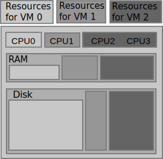

In the previous episode we looked at how the Internet works at a very basic level. To visit a website you enter an domain name into your browser which is converted to an IP address which directs your request to a computer (or LAN which then routes your request to a specific computer within that LAN based on the type of traffic) which then provides your computer with the data for the web page you requested. 

Anyone connected to the Internet can potentially put up a website for the world to see. This ability for anyone to create a website is part of what makes the Internet so great, in that you don't need lots of money and infrastructure to do this, just a computer and an Internet connection and some time to burn setting it up. However, what happens as your website grows in popularity? You get many more computers requesting your content, at some point this becomes too much for a single computer to handle so, you have to go out and get more computers. This adds not only the cost of the computers but also the time to set them up. In addition, that high load you just got, well it was a passing phase, and no one wants to visit your site any more and you have 10 computers you paid for not being used anymore. This is a problem of scalability and elasticity. The problem of a lack of **scalability** arises from not being able to easily increase your hardware resources to cope with an increased demand for your website. The problem of a lack of **elasticity** arises when you can not return the hardware when you no longer require it.

## What is cloud computing?

Cloud computing can solve the problem of scalability and elasticity described above, but what is the cloud and how does it solve this problem?

A first description of the cloud could be **it is someone else's computer that you rent or borrow**. But borrowing or renting your friend's laptop is not a cloud, so there is more to a cloud than being someone else's computer. Characteristics which a cloud should have are:

* 

What makes this more interesting, and more than anything, practical is that this "renting" or "loaning" of other people's computer is all done with software. A person, or more likely a company, runs a piece of software on their computers allowing you to choose your hardware through a web interface. This software uses what is called "virtualization" to simulate hardware using software. An example of virtualization is a file on the underlying computer operating system which acts like a physical hardrive in a virtual computer. It is not a real hard drive, but rather a file in the host operating system's file system.

Why on earth would you want to simulate hardware within software? Consider the case that you have one computer with many CPUs, lots of RAM, and one very large disk and you want to rent it out and you want to allow the renter full control over the computing environment. That means then that you can only rent it out to one person, since different people can not setup different computing environments at the same time; there is only one operating system running on a computer at a time. Then you would only be able to rent it out to one person with very big requirements. With virtualization you can divide up the resources, more importantly the user can choose how many resources they need. For example one CPU can be used for one virtual computer and an other CPU can be used for another virtual computer. In this case a computer with two CPUs can allow for two smaller virtual computers to run simultaneously on it each running there own separate operating system.

## Cloud Service Models

* IaaS
* PaaS
* SaaS
* XaaS
  * e.g. DBaaS
  * etc.

## Cloud Providers
* AWS
* DigitalOcean
* Microsoft Azure

## Why Compute Canada Cloud?

## OpenStack

* the cloud under the hood can be complicated luckily you don't need to look under the hood to use it. Many people just take their car to a mechanic when there is a problem under the hood similarly with the cloud, contact cloud@computecanada.ca

---
PREREQUISITES 

---
OUTLINE

* What is a cloud
  * Some one Else's computer **DONE**
  * Virtual computers (simulated computers running on real computers) **DONE**
  * Disk Images (simulated disks as files on real disks) **DONE**
  * the descriptions of the above could maybe use some more work/elaboration
* Go over components of Horizon (Dashboard)
  * Overview (quotas)
  * Instances (VMs)
  * Volumes (disks)
  * Images (archives of Volumes/Static disks)
  * Access & Security
    * Security Groups
    * Key pairs
    * Floating IPs

These items could be left till much later or not mentioned at all

* Access & Security
  * leave API Access till later 
* Networking 
* Orchestration 
* Identity
  
